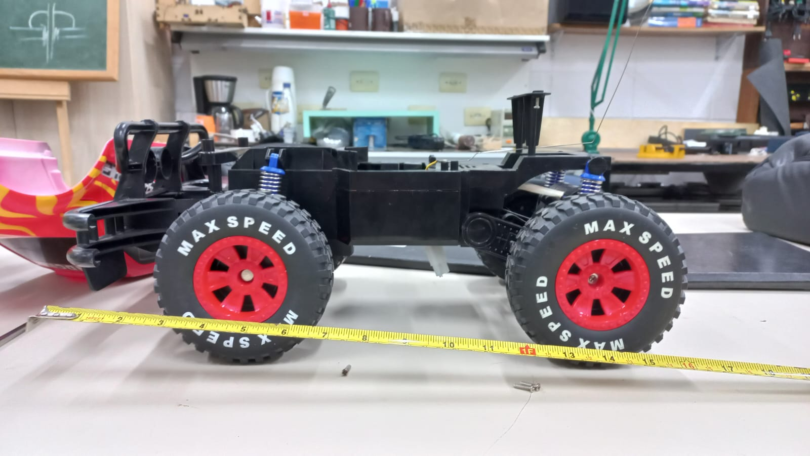

# trekking-GERSE
Desenvolvimento de um robô rádio-controlado/autônomo da moralidade trekking  do GERSE

 

#### **ATIVIDADES**:

As atividades que precisam serem feitas encontram se na aba `Projects`.

 

Alguns dos elemento desse robô serão iguais ao outro [trekking Voyager](https://github.com/pedro-ibs/trekking) principalmente a eletrônica, onde faremos uso do [driver de controle e instrumentação](https://github.com/pedro-ibs/trekking/blob/main/circuito/rasp-sense33):

 

 

Também será utilizado protocolos, processo de comunicação e técnicas para controle de motores semelhantes com os utilizados na [firmware principal](https://github.com/pedro-ibs/trekking/tree/main/firmware/RPI_PICO_SDK) do [trekking Voyager](https://github.com/pedro-ibs/trekking), responsável pelo controle fino dos motores. Evidentemente haverá diferença, pois as estruturas, quantidades de motores e forma de direcionamento são diferentes entre os robôs. O mesmo será atribuído para a [firmware de aquisição (instrumentação)](https://github.com/pedro-ibs/trekking/tree/main/firmware/acquisitionSystem), onde se encontram alguns dos sensores impotentes para a orientação dos robôs no ambiente, como bussolas, barômetro, e a unidade de medidas inerciais. Contudo a topologia de comunicação entres os componentes eletrônicos dos robôs serão a mesma e ou muito semelhantes:

 

 

O robô do GERSE, será em cima de uma estrutura de um automodelo elétrico de rali, que será modificado para atender as especifidades do projeto:

 

 

